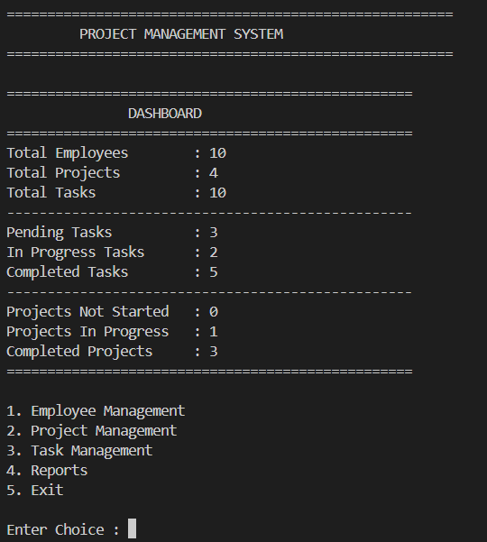

# Project Management System

Project Management System is a console-based Python application developed to manage employees, projects, and tasks efficiently. It provides a simple menu-driven interface that allows users to add, update, search, and delete records while storing all data in CSV files.

## Description

### Employee Management
Users can manage employee details by adding, viewing, searching, updating, and deleting employee records. Each employee is assigned a unique Employee ID.

### Project Management
Users can create projects by providing project details such as project name, deadline, and status. Projects can also be searched, updated, deleted, and their status can be changed.

### Task Management
Users can assign tasks to employees under specific projects. Each task contains details such as task name, description, priority, deadline, assigned employee, and current status. Tasks can also be searched, updated, deleted, and their status can be modified.

### Reports
The application provides different reports to help monitor project progress, including:

- Dashboard Summary
- Employee Report
- Project Report
- Task Report
- Tasks by Employee
- Tasks by Project
- Pending Tasks
- Completed Tasks
- Overdue Tasks
- Project Progress Report

---

## How to Use

### Employee Management

Select **Option 1** from the main menu.

You can:

- Add Employee
- View Employees
- Search Employee
- Update Employee
- Delete Employee

---

### Project Management

Select **Option 2** from the main menu.

You can:

- Add Project
- View Projects
- Search Project
- Update Project
- Delete Project
- Change Project Status

---

### Task Management

Select **Option 3** from the main menu.

You can:

- Add Task
- View Tasks
- Search Task
- Update Task
- Delete Task
- Update Task Status

---

### Reports

Select **Option 4** from the main menu.

Available reports include:

- Dashboard
- Employee Report
- Project Report
- Task Report
- Tasks by Employee
- Tasks by Project
- Pending Tasks
- Completed Tasks
- Overdue Tasks
- Project Progress

---

### Exit

Select **Option 5** from the main menu to close the application.

---

## Languages or Technologies Used

This application is developed using:

- Python 3
- CSV File Handling
- Object-Oriented Programming (OOP)
- Modular Programming

No external libraries are required.

---

## How to Run

1. Make sure Python 3 is installed on your system.

2. Download or clone this repository.

3. Open a terminal or command prompt.

4. Navigate to the project folder.

5. Run the following command:

```bash
python main.py
```

6. Follow the on-screen menu to manage employees, projects, tasks, and reports.

---

## Data Storage

The application stores data in CSV files.

- employees.csv
- projects.csv
- tasks.csv

All changes are automatically saved in these files.

---

## Demo



---

## Author

**Nallimilli Saranyareddy**